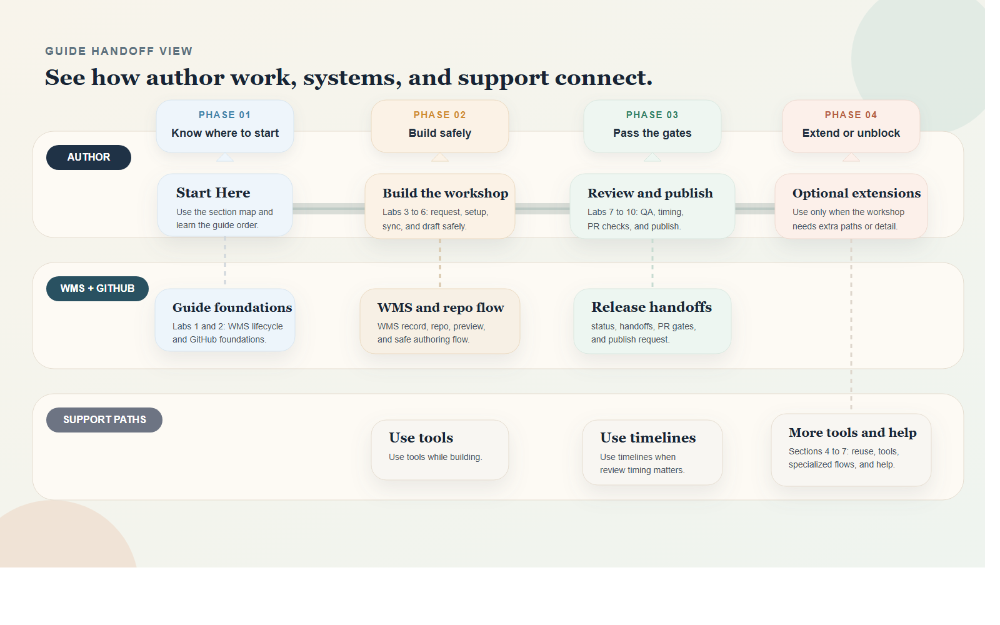

# Start Here

## Introduction

Use this opening section to understand how the guide is organized before you move into execution. The section pages in this guide are navigation anchors: they group related pages and labs, explain when to use them, and make it easier to find the right content quickly. Use the visual map below as a fast orientation pass before you go into the detailed tasks.

Estimated Time: 10 minutes

### Objectives

* Understand the difference between a LiveLabs workshop, lab, and sprint
* Understand the main author path through the guide
* Know which introductory labs to read before the hands-on workflow
* Know which later sections are optional support or specialized workflows

## Quick Visual Guide

Use this map to understand the guide at a glance before you start reading in detail. The top lane shows the main author path, the middle lane shows where WMS and GitHub context matter, and the bottom lane shows support material you can use when it becomes relevant.

Read this image once now, then return to it whenever you need to reorient yourself or decide which section to open next.

## Task 1: Know The Core LiveLabs Content Types

| Term | Summary | How it differs |
| --- | --- | --- |
| LiveLabs workshop | A full guided learning experience published on LiveLabs. It usually includes multiple labs, images, supporting files, and a manifest that defines the learner flow. | This is the main unit authors usually create, refresh, or republish. |
| Lab | A guided part of a workshop that covers one major topic or stage in the flow. Labs contain the actual step-by-step tasks learners follow. | A lab is part of a workshop, not a separate publishing model. |
| Sprint | A shorter, narrower LiveLabs experience built for one focused outcome and faster completion. | A sprint is lighter than a full workshop and uses a more specialized workflow. |

## Task 2: Know Where Workflow, QA, and SLAs Fit

* **WMS workflow** tracks the workshop from submission through approval, development, QA, and publishing.
* **QA** checks whether the workshop is complete, accurate, and ready for stakeholder review or production.
* **SLA** sets the expected turnaround time for reviews, approvals, publishing, and support follow-up.

## Task 3: Use The Guide In The Right Order

| Section | Use it for | Read it now? |
| --- | --- | --- |
| Start Here | Orientation, context, and guide structure | Yes |
| Core Workflow | The required hands-on author path | Next |
| Validation and Publish | Review readiness, QA, and production handoff | Yes, after your draft is working |
| Reuse and Enhancements | Optional components such as FreeSQL and quizzes | As needed |
| Tools and Productivity | Screenshots, image optimization, and cleanup | As needed during development |
| Specialized Workflows | Sprints, remote desktop, and Marketplace image flows | Only if your workshop needs them |
| Help and FAQ | FAQ, support routes, and quick unblockers | As needed |

## Task 4: Read The Key Introductory Labs Before The Hands-On Workflow

| Lab | Open it when | Then continue with |
| --- | --- | --- |
| Lab 1: WMS lifecycle, QA, and publishing flow | You need context on statuses, approvals, QA, or publishing handoffs | Core Workflow or Validation and Publish |
| Lab 2: GitHub foundations | You need context on repositories, forks, clones, or previews | Core Workflow |

## Task 5: Follow The Main Author Path

1. Start with **Start Here** to understand the guide and the core LiveLabs context.
2. Read **Lab 1: WMS lifecycle, QA, and publishing flow** and **Lab 2: GitHub foundations** before the hands-on authoring labs.
3. Move into **Core Workflow** for the actual author path.
4. Move into **Validation and Publish** once your content, images, and manifests are ready for review.
5. Use **Reuse and Enhancements** and **Tools and Productivity** only when those topics become relevant to the workshop you are building.
6. Use **Specialized Workflows** only when your workshop needs sprint, desktop, or Marketplace-specific steps.
7. Return to **Help and FAQ** whenever you need FAQ, support, or escalation guidance.

## Acknowledgements

* **Last Updated By/Date:** Workshop Author Docs Refresh, March 2026
