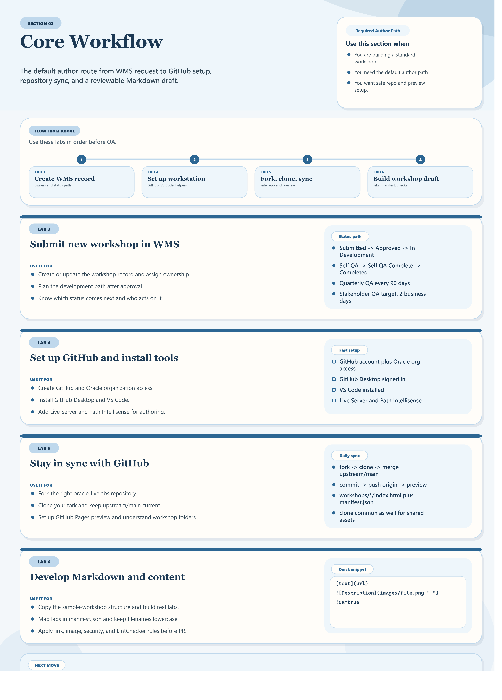

# Core Workflow

## Introduction

This section is the hands-on author path. Once you understand the guide, the WMS flow, and the GitHub model, work through these labs in order before you move into QA and publish.

Estimated Time: 10 minutes

## Quick Visual Guide

## Task 1: Follow The Main Author Path

| Step | Open this page or lab | Use it for | Outcome | Link |
| --- | --- | --- | --- | --- |
| 1 | Lab 3: Submit new workshop in WMS | Create or update the WMS entry and ownership details | A correct workshop record and status path | [Open](../workshops/core-workshop-flow/index.html?lab=1-labs-wms) |
| 2 | Lab 4: Set up GitHub and install tools | Prepare GitHub, GitHub Desktop, VS Code, and core extensions | A ready authoring workstation | [Open](../workshops/core-workshop-flow/index.html?lab=2-labs-github) |
| 3 | Lab 5: Stay in sync with GitHub | Fork, clone, sync, preview, and understand repository structure | A safe working repo and preview path | [Open](../workshops/core-workshop-flow/index.html?lab=3-labs-sync-github) |
| 4 | Lab 6: Develop Markdown and content | Build the workshop structure, manifests, content, images, and reuse patterns | A reviewable workshop draft | [Open](../workshops/core-workshop-flow/index.html?lab=4-labs-markdown-develop-content) |

## Objectives

* Know the required author path for most workshops
* Know what each core lab covers
* Know when to pull in supporting sections without losing the main flow

## Task 2: Pull In Supporting Sections At The Right Time

| If you need... | Go to... | Why |
| --- | --- | --- |
| Review, self-QA, publishing, or timeline expectations | Validation and Publish | It covers QA, publishing, and the timeline details page |
| Optional interactive or reusable workshop elements | Reuse and Enhancements | It covers FreeSQL and quizzes |
| Better screenshots or smaller image files | Tools and Productivity | It covers capture standards, optimization, and cleanup |

## Acknowledgements

* **Last Updated By/Date:** Workshop Author Docs Refresh, March 2026
