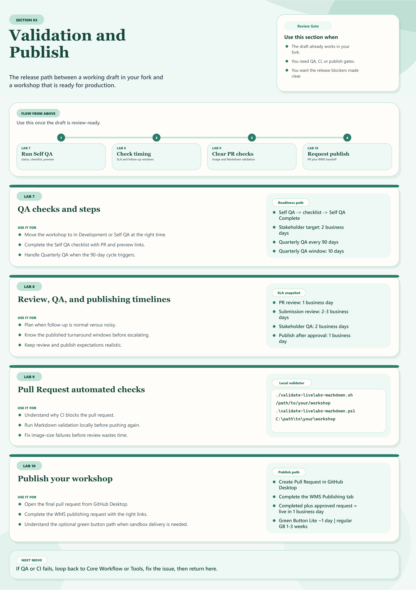

# Validation and Publish

## Introduction

Use this section when your workshop draft is ready for review. These labs cover the quality gates between "the content works in my fork" and "the workshop is ready for production."

Estimated Time: 10 minutes

## Quick Visual Guide

## Objectives

* Know the sequence from review-ready content to production publish
* Know where self-QA, automated pull request checks, and publishing fit
* Know where to find the timeline expectations for review and publishing handoffs
* Know when to loop back to earlier sections to fix issues

## Task 1: Follow The Readiness Gates In Order

| Step | Open this page or lab | Use it for | Outcome | Link |
| --- | --- | --- | --- | --- |
| 1 | Lab 7: QA checks and steps | Share a reviewable preview, update WMS status, and complete self-QA or quarterly QA | A workshop ready for stakeholder review | [Open](../workshops/validation-qa-publish/index.html?lab=5-labs-qa-checks) |
| 2 | Lab 8: Review, QA, and publishing timelines | Check expected turnaround times for review, stakeholder QA, publishing, and follow-up | Better planning and cleaner escalation timing | [Open](../workshops/validation-qa-publish/index.html?lab=sla) |
| 3 | Lab 9: Pull Request automated checks | Understand and fix CI failures that block your pull request | A clean or explainable PR status | [Open](../workshops/validation-qa-publish/index.html?lab=prcheck) |
| 4 | Lab 10: Publish your workshop | Open the final PR and complete the WMS publishing request | Content ready for production deployment | [Open](../workshops/validation-qa-publish/index.html?lab=6-labs-publish) |

## Task 2: Return To Earlier Sections When QA Finds Gaps

| If QA or review finds... | Go back to... | Why |
| --- | --- | --- |
| Missing or weak screenshots | Tools and Productivity | Fix capture quality and image optimization |
| Markdown or manifest issues | Core Workflow -> Lab 6 | Repair content structure and authoring issues |
| Optional component confusion | Reuse and Enhancements | Revisit whether FreeSQL or quizzes belong in the workshop |

## Acknowledgements

* **Last Updated By/Date:** Workshop Author Docs Refresh, March 2026
