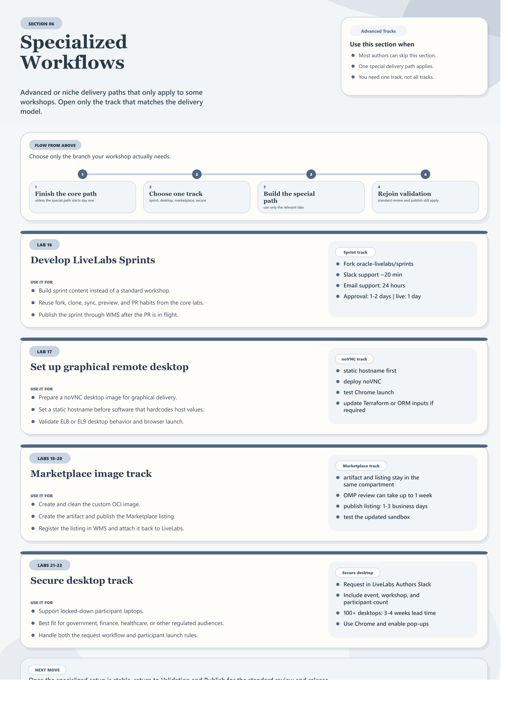

# Specialized Workflows

## Introduction

Use this section for advanced or niche workflows that only apply to some workshops. These topics are intentionally separated from the core author path so most authors can stay focused on the main flow.

Estimated Time: 10 minutes

## Quick Visual Guide

## Task 1: Open Only The Labs That Match Your Delivery Model

| Lab | Use it when | Primary outcome | Link |
| --- | --- | --- | --- |
| Lab 16: Develop LiveLabs Sprints | You are authoring sprint content instead of a standard workshop | A sprint-ready structure, preview path, and publish flow | [Open](../workshops/specialized-workflows-reference/index.html?lab=10-create-sprints-workflow) |
| Lab 17: Set up graphical remote desktop | Learners need a graphical desktop environment | A remote desktop workflow for the workshop | [Open](../workshops/specialized-workflows-reference/index.html?lab=6-labs-setup-graphical-remote-desktop) |
| Lab 18: Create custom image for Marketplace | You need a custom image before Marketplace publication | A prepared image for Marketplace intake | [Open](../workshops/specialized-workflows-reference/index.html?lab=7-labs-create-custom-image-for-marketplace) |
| Lab 19: Publish your image to Oracle Marketplace | The custom image is ready to publish | A Marketplace-published image listing | [Open](../workshops/specialized-workflows-reference/index.html?lab=8-labs-publish-custom-image-to-marketplace) |
| Lab 20: Update the image on your sandbox environment | A published Marketplace image needs to be attached to a LiveLabs environment | A sandbox environment that uses the new image | [Open](../workshops/specialized-workflows-reference/index.html?lab=12-add-custom-image-to-workshop) |
| Lab 21: Secure Desktop environments in LiveLabs | You need OCI Secure Desktop delivery context | A decision point for secure desktop use | [Open](../workshops/specialized-workflows-reference/index.html?lab=secure-desktop) |
| Lab 22: Request and access Secure Desktop environments | You need the operational steps for secure desktop access | A request and access process for the environment | [Open](../workshops/specialized-workflows-reference/index.html?lab=secure-desktop-how-to-request) |

## Objectives

* Identify which advanced workflows are actually relevant to your workshop
* Keep specialized setup separate from the standard author path
* Find the right reference quickly when your delivery model requires it

## Task 2: Keep Specialized Work Separate From The Main Flow

1. Complete the core author path first unless the specialized workflow changes your structure from day one.
2. Use the specialized labs that match your workshop delivery model and skip the rest.
3. Return to **Validation and Publish** once the specialized setup is stable enough for review.

## Acknowledgements

* **Last Updated By/Date:** Workshop Author Docs Refresh, March 2026
